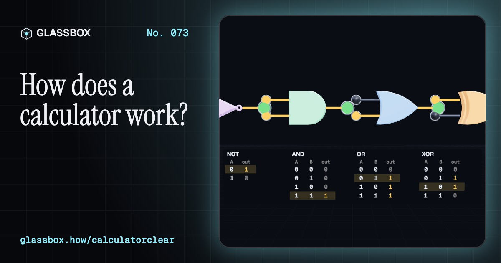
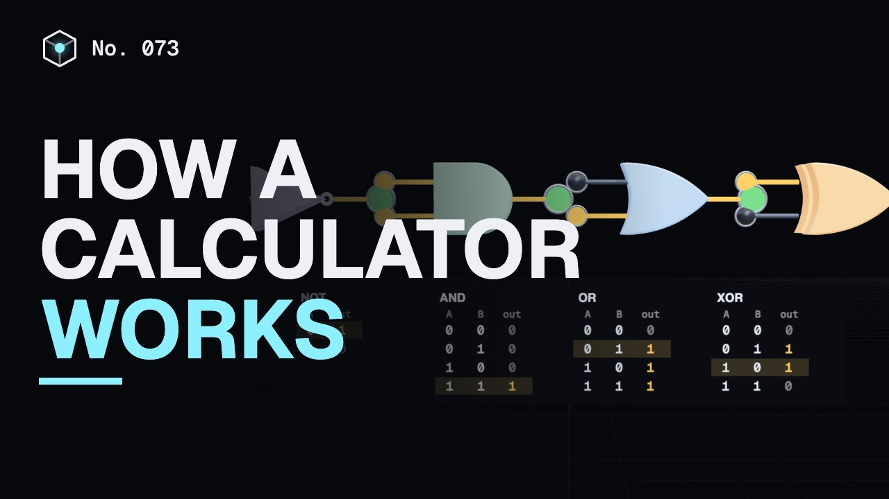
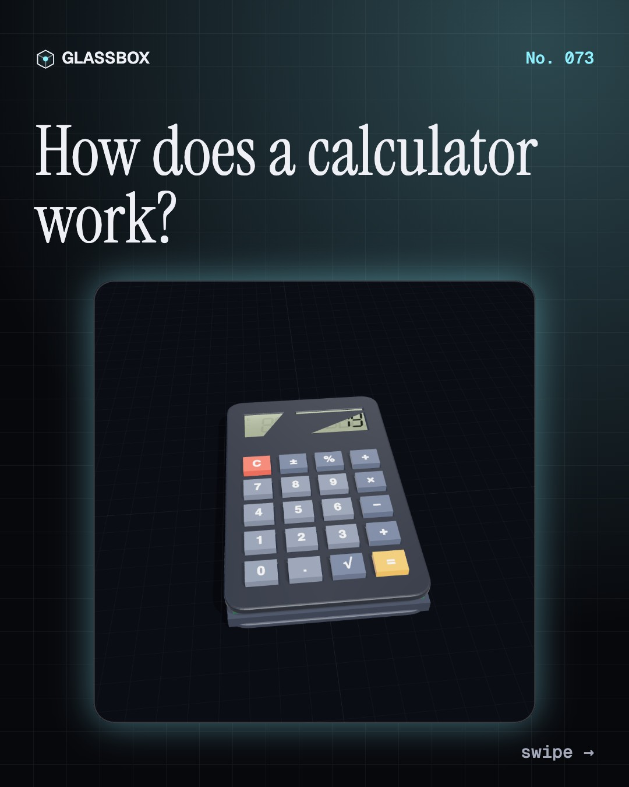
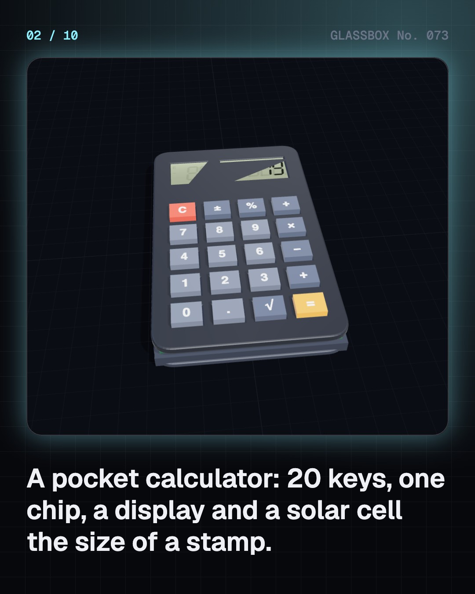
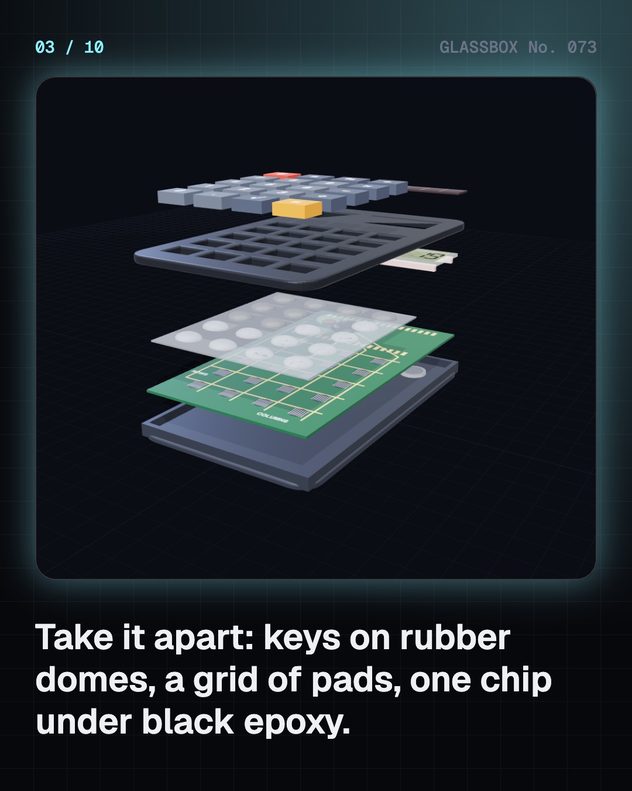
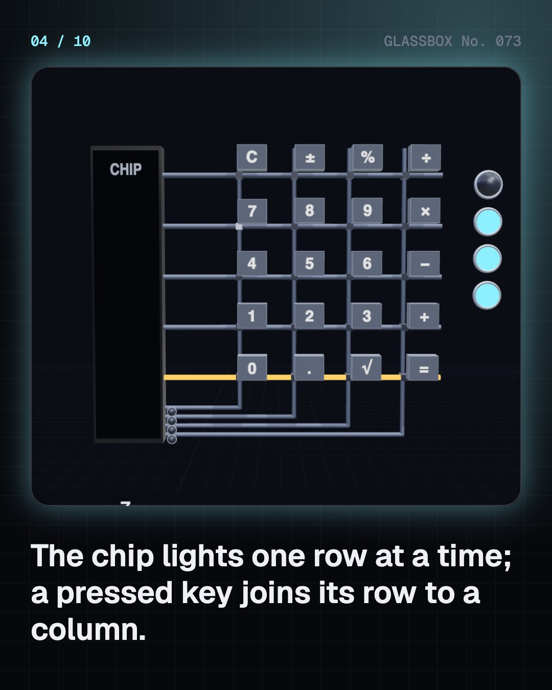

<!-- glassbox:start -->
<!-- Generated from glassbox.json by the Glassbox hub (npm run readme -- calculatorclear). Edit glassbox.json, not this block. -->
<p align="center"><a href="https://glassbox.how/e/calculatorclear/"></a></p>

<h1 align="center">CalculatorClear</h1>

<p align="center"><b>How does a calculator work?</b><br>Press 7 and a chip scans a grid of wires, waits out the bounce and stores 0111. Build the adder from real logic gates, watch the carry ripple, and see why 1 ÷ 3 × 3 can come out as 0.9999999.</p>

<p align="center"><a href="https://glassbox.how/calculatorclear/"><b>▶ Play with it</b></a> &nbsp;·&nbsp; <a href="https://glassbox.how/e/calculatorclear/">Read the 60-second explainer</a> &nbsp;·&nbsp; <a href="https://glassbox.how/calculatorclear/glassbox/reel.mp4">Watch the 40-second video</a></p>

<p align="center">
  <a href="https://glassbox.how/e/calculatorclear/"></a>
  <a href="https://glassbox.how/e/calculatorclear/"></a>
  <a href="LICENSE"></a>
  <a href="LICENSE-CONTENT.md"></a>
  <a href="#privacy"></a>
</p>

## In 60 seconds

1. **A handful of parts.** Open a pocket calculator and you find rubber keys with carbon pills, a circuit board with a grid of pads, one chip under a blob of black epoxy, an LCD, and a solar cell with a button cell for backup. Everything clever happens inside the chip.
2. **Keys become bits.** The 20 keys sit where 5 row wires cross 4 column wires. The chip powers one row at a time and listens on the columns. It waits out the few milliseconds of contact bounce, then stores the digit in 4 bits of binary-coded decimal: 7 is 0111.
3. **Switches that decide.** Transistors are switches worked by electricity. A few of them make a logic gate: NOT flips a bit, AND needs both inputs, OR needs either, XOR needs them different. In CMOS a NOT gate is just 2 transistors, one pulling up to 1 and one pulling down to 0.
4. **Adding is XOR and AND.** The sum bit of two bits is XOR and the carry is AND. Five gates make a full adder, and four in a row add 4-bit numbers while the carry ripples through, 2 gate delays per bit. Flip B and add 1 and the same adder subtracts; shift and add, and it multiplies.
5. **Seven bars of liquid crystal.** A decoder turns each 4-bit digit into 7 segment signals. In each segment, liquid crystal twists light 90° between crossed polarisers so it looks pale. About 3 volts stands the molecules up, the twist is lost and the segment goes dark.
6. **Microwatts and the last digit.** CMOS and LCDs need so little power that a stamp-sized solar cell in room light runs the calculator. With only 8 digits, 1 ÷ 3 × 3 gives 0.9999999. Scientific calculators hide guard digits, and many find sin and cos with CORDIC: shifts and adds.

## Words worth knowing

| Term | Meaning |
|---|---|
| **Key matrix** | Keys wired where rows cross columns, so a few wires can serve many keys. |
| **Debouncing** | Ignoring a switch until its flickering contact has settled. |
| **BCD** | Binary-coded decimal: each decimal digit kept in its own 4 bits. |
| **Transistor** | A switch with no moving parts, turned on and off by a voltage. |
| **Logic gate** | A small circuit that turns input bits into an output bit by a fixed rule, like AND or XOR. |
| **Full adder** | Five gates that add two bits and an incoming carry. |
| **Two's complement** | Subtracting by adding: flip every bit of the number and add 1. |
| **Seven-segment display** | Seven bars that together can draw any digit from 0 to 9. |
| **CORDIC** | A way to compute sin and cos by turning in shrinking steps, using only shifts and adds. |

## A short history

**4,000 years from pebbles on a board to a solar-powered chip in every school bag.**

- **190** · The Chinese bead abacus (Described by Xu Yue (attributed), China)
- **1617** · Napier's bones (John Napier, Edinburgh, Scotland)
- **1642** · The Pascaline (Blaise Pascal, Rouen, France)
- **1673** · Leibniz's stepped drum (Gottfried Wilhelm Leibniz, London and Hanover)
- **1851** · The arithmometer goes on sale (Thomas de Colmar, Paris, France)
- **1887** · The Comptometer: press a key to add (Dorr E. Felt, Chicago, USA)
- **1961** · ANITA, the first all-electronic desktop calculator (Bell Punch Company (Sumlock Comptometer), London, UK)
- **1967** · Cal Tech: a calculator you could hold (Jack Kilby, Jerry Merryman and James Van Tassel, Texas Instruments, Dallas, USA)

The full story, with 26 moments, charts, people and 38 sources: [glassbox.how/e/calculatorclear/history](https://glassbox.how/e/calculatorclear/history/). The data lives in [`history.json`](history.json).

## Video and slides

Made with the Glassbox studio from this box's storyboard (`window.glassbox.director`). Free to reuse under CC BY 4.0.

<a href="https://glassbox.how/calculatorclear/glassbox/video.mp4"></a>

<p><a href="glassbox/slide-1.jpg"></a> <a href="glassbox/slide-2.jpg"></a> <a href="glassbox/slide-3.jpg"></a> <a href="glassbox/slide-4.jpg"></a></p>

| File | What | Size |
|---|---|---|
| [`glassbox/reel.mp4`](https://glassbox.how/calculatorclear/glassbox/reel.mp4) | Reel / Short, with captions and soundtrack | 1080×1920 |
| [`glassbox/video.mp4`](https://glassbox.how/calculatorclear/glassbox/video.mp4) | YouTube video, with captions and soundtrack | 1920×1080 |
| `glassbox/slide-1…10.jpg` | Instagram carousel | 1080×1350 |
| `glassbox/thumb.jpg` | YouTube thumbnail | 1280×720 |
| `glassbox/cover.jpg` | Share card and repo social preview | 1200×630 |
| [`glassbox/history-reel.mp4`](https://glassbox.how/calculatorclear/glassbox/history-reel.mp4) | “History in 10 moments” Reel / Short | 1080×1920 |
| `glassbox/history-slide-*.jpg` | History carousel | 1080×1350 |
| `glassbox/post.json` | Post copy and schedule used by the publish kit | |

## Privacy

This box has no accounts and no ads, and it ships its own fonts and libraries. When you run it yourself it sends nothing anywhere. On glassbox.how, the site's `/bar.js` also loads Glassbox's analytics: **Google Analytics** to count visits (it asks first in the EU, UK and Switzerland, and stays off when your browser sends Global Privacy Control or Do Not Track) and **ClickTrust** to detect bots.

It remembers a few things **in your own browser only**, and never sends them anywhere:

| Browser storage key | What it holds |
|---|---|
| `calculatorclear.v1` | Which chapters you have opened, your best quiz scores, and sound on or off. |

Exactly what each one sees is at [glassbox.how/privacy](https://glassbox.how/privacy/).

## Licences

- **Code:** [MIT](LICENSE). Use it, change it, ship it.
- **Explanations, text, images and videos** (`glassbox.json`, `glassbox/`): [CC BY 4.0](LICENSE-CONTENT.md). Credit “Glassbox, glassbox.how/e/calculatorclear”.
- **Third-party parts** keep their own licences: [three.js](https://threejs.org) (MIT), [Geist, Instrument Serif](https://openfontlicense.org) (SIL OFL 1.1).
- The Glassbox name and logo aren't covered by either licence. See the [terms](https://glassbox.how/terms/).

Found a mistake? [Open an issue](https://github.com/bdeeps/calculatorclear/issues). Corrections happen in public.
<!-- glassbox:end -->

## Run it

It's plain HTML, CSS and JavaScript. No build step and no dependencies. Run locally, it contacts no other website.

```bash
python3 -m http.server 8000
```

Three.js and the fonts ship in `vendor/` and `fonts/`, so it also works offline.

Then open http://localhost:8000.

## How it's built

| File | What |
|---|---|
| `index.html`, `css/app.css` | The page and its styles |
| `js/app.js`, `js/stage.js`, `js/ui.js`, `js/kit.js` | The shared Glassbox 3D engine: chapters, 3D stage, controls, quiz, video director |
| `js/chapters/*.js` | One file per chapter: the 3D model, controls, text, key terms, quiz and video scenes |
| `js/calc.js` | CalculatorClear's shared models and logic: the working 8-digit calculator engine and 3D pocket calculator, 3D logic gates and wires, a gate-delay logic simulator, seven-segment drawing, the solar-power model and live boards |
| `glassbox.json` | Title, question, explainer beats, key terms, browser storage and credits shown on glassbox.how |
| `reel` in each chapter | The storyboard the Glassbox studio records into short videos |
| `glassbox/` | The published video, slides, thumbnail and post copy |
| `fonts/`, `vendor/three/` | Self-hosted Geist and Instrument Serif (SIL OFL 1.1) and three.js (MIT) |
